<!-- omit from toc -->
# Введение в операционную систему Linux. Основы программирования на языке Python. Введение в операционную систему для роботов ROS

## Содержание

- [Содержание](#содержание)
- [Вводная](#вводная)
- [Терминал](#терминал)
  - [ls](#ls)
  - [mkdir](#mkdir)
  - [cd](#cd)
  - [Больше о перемещении - relative vs. absolute](#больше-о-перемещении---relative-vs-absolute)
  - [А как двигаться назад (наверх)?](#а-как-двигаться-назад-наверх)
  - [mv](#mv)
  - [nano](#nano)
  - [rm](#rm)
- [Скрипты shell](#скрипты-shell)
  - [Переменные](#переменные)
  - [Исполняемость](#исполняемость)
- [Переменные окружения](#переменные-окружения)
  - [Сессия терминала](#сессия-терминала)
  - [Импорт переменных из скрипта](#импорт-переменных-из-скрипта)
  - [Точка входа терминала](#точка-входа-терминала)
- [Команды для обработки вывода](#команды-для-обработки-вывода)
- [Робот, покажись!](#робот-покажись)
- [Пора двигаться!](#пора-двигаться)
- [Научим робота видеть!](#научим-робота-видеть)
- [Робот, который смог (двигаться к цели)!](#робот-который-смог-двигаться-к-цели)
- [Начинаем создавать что-то свое](#начинаем-создавать-что-то-свое)
- [Почему пакеты - это важно?](#почему-пакеты---это-важно)
- [Как мне создать локальный workspace?](#как-мне-создать-локальный-workspace)
- [Готовим тарелку](#готовим-тарелку)

## Вводная


## Терминал

Привет! Сегодня мы познакомимся с тем, как пользоваться командной оболочкой Shell. На самом деле, когда мы в файловом менеджере делаем какие-то действия с помощью GUI (графический интерфейс – Graphical User Interface), то, по сути, исполняются команды CLI (Command Line Interface).
Вообще, в Ubuntu (дистрибутив Linux, в котором мы будем работать с вами) оболочка по-умолчанию – Bash (Bourne Again Shell), однако существует и куча других оболочек, как, например, zsh, fish, xsh.
Одним словом, цель части сегодняшнего занятия – разобраться, как работать с командной строкой.

Итак, открываем терминал – Ctrl + Alt + T (или находим его в меню) и видим следующее окно:

<p align="center">
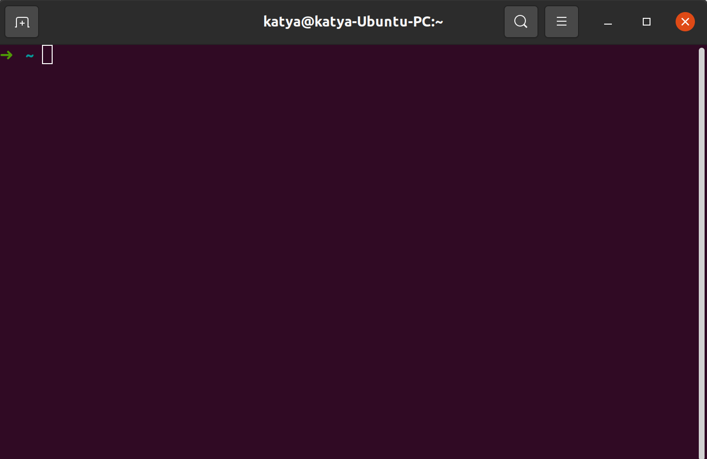
</p>

### ls

Самая первая команда, которой стоит научиться - это команда вывода файлов и директорий в конкретной папке. Для этого используем `ls`:

```bash
ls
# Вывод: Downloads Pictures и т.д.
```

> В зависимости от языка названия папок могут меняться в системе.

Отлично, но что, если мне хочется больше информации о папках и директориях? Вот тут мы встречаемся с **опциями команд**! Опции - это расширения команд, которые позволяют задать желаемое поведение (изменить под себя). Ведь удобно вывести просто список директорий и папок, но что если нужно больше информации? Используем опцию `-l`!

```bash
ls -l
```

и видим

```bash
total 40
drwxr-xr-x 15 user user  4096 Aug  6 23:56 Downloads
...
```

Вооу, сколько информации. Тут и дата последнего редактирования, и пользователь, владеющий файлами и папками и много другого, но мы пока сконцентрируемся на том, что это крутая опция!

> У большинства команд есть опция `-h` (или длинная опция `--help`), которая выводит информацию по всем возможным настройкам утилиты.

:muscle: Выведи помощь к команде `ls` и прочитай, какие ещё есть опции у неё.

### mkdir

Хорошо, выводить информацию полезно, но ещё полезнее научиться управлять файлами и папками. Следующая команда `mkdir` ("make directory") - позволит создавать директории.

:muscle: Создай папку, введя `mkdir super_dir` или другое имя вместо "`super_dir`" в качестве **аргумента** команды. Проверь в `ls` и файловом менеджере, что папка создана.

> Аргумент - дополнительная информация, которая передаётся после команды. Опция отличается наличием символа "-".

Вы смогли сами создать папку? Крууутооо! Погнали внутрь!

### cd

Так, мы папку создали и даже смогли зайти в неё в файловом менеджере, но как нам передвигаться в терминале? Всё просто! Для этого есть команда `cd` ("change directory"). 

:muscle: Перейди в директорию командой `cd super_dir`. Выведи с помощью `pwd` нынешний путь и проверь, что переход удачен.

:muscle: А теперь вопрос на подумать, почему, после первого выполнения перехода в "super_dir" второй уже не работает? А если открыть терминал заново, то снова, один раз работает, а другой раз нет?

Так, мы освоили способ перемещения, но ведь всё подкрепляется практикой, пора создать целую структуру.

:muscle: Создай следующую структуру папок и проверь себя в файловом менеджере. Убедитесь, что вы можете перемещаться по всем этим директориям без проблем.
  - super_dir
    - fruits
      - apple
      - orange
      - pear
    - vegetables
      - lettuce
      - onion
      - cucumber
      - spinach

### Больше о перемещении - relative vs. absolute

Обратим внимание, что два раза команду не выполнить, так как при переходе в папку "super_dir" мы уже находимся в ней. То есть, команда `cd super_dir` - это переход в директорию из нынешней директории. Если внутри `super_dir` нет второй с тем же именем, то и команда несколько раз работать не будет.

Думаю понятно, что как в случае `mkdir`, так и в случае `cd` требуется аргумент, которым является имя для создания/перехода. Этим аргументом у нас являлась директория "super_dir" - работа с директорией из нынешней папки.

Так мы познакомились с относительным путем.

> Относительный (Relative) путь - путь в файловой системе от нынешнего положения. Может быть `super_dir` или `./super_dir`. "`.`" - это символ, который при использовании в пути можно заменить на "отсюда" ("current directory").

Короче, если хотим создавать и делать что-то из нынешней директории, то пользуемся **относительными** путями.

А что если теперь выполнить команду `cd /home/user/super_dir` (обрати внимание, у тебя вместо `user` в `pwd` могло быть другое имя пользователя)? Попробуй! Несколько раз подряд? :muscle:

Интересно, а такая команда выполняется, почему?

Всё просто, в этом случае мы задаём **абсолютный** путь в файловой системе:

> Абсолютный (Absolute) путь - путь в файловой системе от "`/`" (корня).

Абсолютным путёём не всегда удобно пользоваться, но в некоторых ситуациях он полезен, поэтому мотаем на ус.

### А как двигаться назад (наверх)?

Если так подумать, то после создания нашей базы знаний фруктов и овощей (задачка про папки с `fruits/vegetables`) мы умеем только двигаться вперёд с помощью `cd` и относительного пути.

После изучения абсолютного пути, мы может вернуться в корень нашей базы (`cd /home/user/super_dir`) и снова двигаться вглубь. Но что если я хочу из папки `orange` вернуться в папку `fruits`?

> Да можно сделать `cd /home/user/super_dir/fruits`, но смотри дальше, там будет фокус с точками!

Что, если я скажу, что "`.`" - это нынешняя директория (можешь даже попробовать `cd .` =)), а директория выше по дереву - это, погоди-погоди, **две точки**!

Да, именно "`..`" определяет путь до папки выше по дереву. (В некоторых интерпретаторах "`...`" - это подъём на два уровня выше).

Итого, если тебе нужно передвинуться из `apple` папки в папку `fruits` - просто делаешь `cd ..` и вот, цель достигнута!

:muscle: Ну всё, теперь ты умеешь просто профессионально двигаться в командной строке! Погнали, зайди в каждую папку, выйди из неё и переместись в следующую! Время путешествий!

### mv

Так, мы подошли к моменту, когда в нашей базе мы не хотим иметь лук (onion), не нравится он нам, а поменяем его на тыкву!

Синтаксис команды для переименования папок и файлов:

```bash
mv <оригинальное имя> <новое имя>
```

Например, `mv super_dir new_super_dir` переименует нашу базовую директорию. Делать это не обязательно, пойдём сразу практиковаться!

:muscle: Переименуй лук в тыкву (pumpkin). Также, переименуй один любой фрукт в любой другой фрукт.

Такс, такс, базу мы подредактировали, молодцы!

### nano

Папки это хорошо, но мы не за тем учимся терминалу, чтобы просто создавать папки! Сейчас мы очень быстро научимся создавать и редактировать текстовые файлы!

> А с учётом того, что исходники - это текстовые файлы, то это очень полезный навык!

Переходим в директорию `super_dir` (это вы уже умеете, так что сами) и создаём там текстовый файл с описанием нашей базы фруктов и овощей:

```bash
nano description.txt
```

Откроется редактор нового файла:

<p align="center">
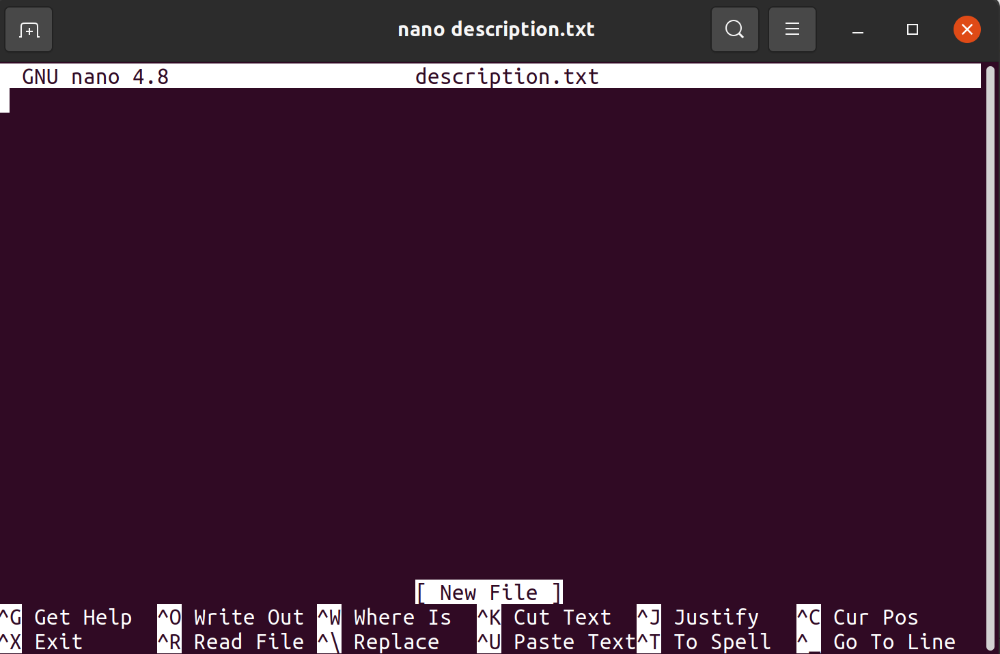
</p>

Работать в нём просто, двигаете курсор с помощью стрелок указателей и набираете текст.

Чтобы выйти, нам помогает подсказка "^X Exit". Символ "^" означает клавишу "Ctrl", так что для выхода нажимаете "Ctrl+X".

Но перед этим надо сохранить файл, "^O Write Out", то есть, "Ctrl+O".

Если не сохранить, но выйти - нам напомнят о том, что файл не сохранен! Удобно!

> В nano ещё куча разных hotkey комбинаций, например, вырезать всю строку, поиск в файле и т.д. Больше инфы найдете [здесь](https://www.nano-editor.org/dist/latest/cheatsheet.html)!

Обычно в практике nano не используется постоянно, но это удобно, если нужно быстро подредактировать/посмотреть какой-то файл, а в редакторе типа VSCode отдельно открывать долго.

> Если хотите просто создать пустой файл и не редактировать его, то можно воспользоваться командой `touch another_description.txt` (имя файла своё), но на практике такое нужно редко, так что `nano` рулит. 

:muscle: Самое время в каждой папке фрукта и овоща написать краткое описание с помощью `nano`. Например, в `description.txt` внутри "apple" папки пишем "Красное и круглое". Попробуйте создавать и редактировать файлы с помощью относительных и абсолютных путей. Так же, помимо nano есть много других популярных текстовых редакторов, например Vim или Emacs, не бойтесь экспериментировать и выбирать инструменты себе по душе.

### rm

Стоит упомянуть и о возможности удаления файлов и папок с помощью команды `rm`.

Чтобы удалить файл, достаточно написать `rm description.txt`, то есть, просто указав путь до файла в качесте аргумента.

Для удаления папок используем опцию `-r`, которая проходит внутрь папок и удаляет файлы и папки внутри (рекурсивно).

## Скрипты shell

Смотри, мы сделали уже кучу действий и каждую команду набирали вручную. А что, если нам потребуется выполнить эти действия на другом компьютере повторно? Например, снова создать структуру файлов, которую мы делали ранее.

Вспоминать и по памяти (или с листочка) снова их последовательно делать - не вариант! Погнали знакомиться со скриптами!

Скрипты - это просто набор команд, который выполняется последовательно. Есть ещё широкоизвестное название "макросы", но тут им не пользуются.

Чтобы сделать Bash скрипт, достаточно создать файл с расширением `.sh`.

:muscle: Перейди в папку "super_dir" и внутри создай файл `my_first_script.sh`. Внутри скрипта напиши всего одну команду - `echo "Hello World!"`.

Отлично, у нас есть скрипт, который приветствует, но как его вызвать, чтобы он выполнил команды? Всё очень просто, явно вызываем интерпретатор:

```bash
bash my_first_script.sh
```

Великолепно! Вот мы и научились создавать скрипты! Но мы на этом не останавливаемся - дальше интереснее!

### Переменные

Внутри bash существует возможность использовать переменные. Определяются они максимально просто, пишем имя переменной, знак "=", значение.

> :warning: Важно, что пробелов между именем, "=" и значением быть не должно!!!

Например, чтобы вывести "World" через переменную, делаем так:

```bash
WORLD_STRING="world"

echo "Hello $WORLD_STRING!"
```

Заметили? В первой строке определили переменную, а в третьей к ней обратились. Обращение к переменной делается через символ "$".

> Но что, если мне надо вывести прямо символ "$"? В таком случае ведь всё после этого символа будет использовано как имя переменной? Агась, но для этого можно использовать символ экранирования "`\`". Например `echo "Million \$s i have"`

:muscle: В своём скрипте напиши код, который будет выводить строку "`Hello World! My name is User!`", где вместо "`User`" будет подставляться твоё имя.

### Исполняемость

В ряде случаев мы не можем явно указать вызов интерпретатора `bash script.sh`.

Как быть? Как нам тогда запускать скрипты, ведь это так удобно!

Что если я скажу тебе, что можно прописать интепретатор прямо в файле! Как это сделать? Сейчас покажу, прописывай это в начало своего скрипта самой первой строкой:

```bash
#!/usr/bin/bash
```

Такая строка называется [shebang](https://ru.wikipedia.org/wiki/%D0%A8%D0%B5%D0%B1%D0%B0%D0%BD%D0%B3_(Unix)) и такую штуку можно встретить не только в Bash скриптах. Главное, что это только одна часть исполняемости. Мы пока только прописали интерпретатор, а в Linux нужно сделать ещё один момент, дать файлу права на исполнение.

> Shebang имеет синтаксис `#!interpreter [optional-arg]`. `interpreter` должен быть абсолютным путём до интерпретатора. 

```bash
chmod +x my_first_script.sh
```

> Команда `chmod` позволяет менять "права" у файла, например, можно сделать файл "read-only", или (как в нашем случае) сделать скрипт исполняемым. 

После этого выведи `ls -l my_first_script.sh` и в строке разрешений будет видна буква "`x`" - это значит, что файл стал исполняемым!

Теперь, после этих незамысловатых магических действий (ещё раз, в файл прописали интерпретатор и сделали файл исполняемым) мы можем вызывать скрипт всего лишь вот так:

```bash
./my_first_script.sh
# или по абсолютному пути: /home/user/super_dir/my_first_script.sh, но это обычно неудобно =)
```

В результате мы должны увидеть всё то же самое, что видели при вызове `bash my_first_script.sh`!

Если получилось - круто! Таким образом, можно сделать любой файл исполняемым, главное прописать, каким интерпретатором исполняемым.

> Если прочитаете статью про shebang, то увидите, что лучшей практикой является использовать `#!/usr/bin/env bash`.

## Переменные окружения

Помнишь, буквально недавно мы разобрались, что в bash есть переменные. Но те переменные, что есть в скрипте, существуют только при вызове скрипта. 

:muscle: Если сомневаетесь, попробуйте определить переменную `MY_SCRIPT_VAR`, вызвать скрипт с ней и после вызова проверить, есть ли она в терминале командой `echo "$MY_SCRIPT_VAR"`.

Думаю, ты удивишься, если мы представим, что весь терминал - это один большой долго исполняющийся скрипт =)

Это всё к чему? В нашем терминале определена куча разных переменных, которые используются системой. Чтобы получить этот список, достаточно вызвать команду `env`. Попробуйте!

Этой командой мы выводим весь список **переменных окружения**, которые определены в **сессии терминала**. Воу, целых два новых термина ...

Да, начнём с переменных окружения - это переменные, которые немного отличаются от обычных переменных.

Давай представим, что у нас есть скрипт, который вызывает другой скрипт. Так вот, переменные из первого скрипта не будут доступны во втором, так как это обычные переменные.

А вот если её определить через `export VARIABLE=value` (прописав `export` перед переменной), то она станет переменной окружения, станет круче и будет видна всем дочерним скриптам (тем, который создаются из основного нашего скрипта).

А зачем нам сейчас это знать? Да всё просто, весь запуск системы - это запуск кучи скриптов одного в другом. А в системе есть пачка полезных переменных окружения, о которых нам надо знать:
- `HOME` - путь до домашней директории пользователя;
- `PATH` - пути до директорий, где искать утилиты для исполнения;
- `PWD` - путь до нынешней директории;
- `USER` - имя пользователя

:muscle: Попробуй каждую из переменных вывести с помощью `echo`.

Итого, переменные окружения определяются где-то в запуске и поэтому, будь они обычными, мы бы до них не добрались. А так, просто знайте, что переменные окружения очень полезны.

### Сессия терминала

Такс, а что с сессиями? Что это такое?

Давай проведём простой эксперимент: открой два терминала, в одном определи переменную окружения `export MY_VAR=10` и проверь, что в этом терминале она есть в `env` и выводится через `echo`.

Отлично, а теперь сделай `env` и `echo` (без её определения!) во втором терминале на эту переменную и найди её.

Её нету? Как? Проверь ещё раз!

Окей, если так и не получилось найти, то ты теперь знаешь, что такое сессии - это отдельные пространства, в которых есть свои переменные.

То есть, если создать два терминала, то создаётся две сессии, которые между собой не делятся переменными и остальным. Скажу больше, вызов скрипта - это отдельная сессия, но если определить переменную окружения в терминале и в этом же терминале вызвать скрипт, то это переменная окружения будет доступна скрипту. Но она не будет доступна, если вызвать тот же скрипт в другом терминале.

Запутал? Не переживай! Просто помни, если переменная не определена, то может неправильно сделана настройка установки переменных. Они наследуются по принципу, если раньше не было определено, то и не будет.

### Импорт переменных из скрипта

Мы уже убедились, что команды в скрипте - это удобно. Раз, и все команды вызваны. Но что, если я хочу сделать также с переменными окружения? Написать скрипт, который в сессии определит все нужные переменные?

Есть в bash такая возможность, называется "env sourcing".

По сути, мы в скрипте пишем экспорты переменных, которые хотим определить в сессии и хитро вызываем. Давай напишем скрипт `env_pack.sh`:

```bash
#!/usr/bin/env bash

export VAR_ONE="one"
export SUPER_VAR="puper"
export BIBA="boba"
```

Сохраним, делаем исполняемым.

Теперь, попробуй вызвать скрипт и после проверить эти переменные через `echo`:

```bash
./env_pack.sh

echo $VAR_ONE
echo $SUPER_VAR
echo $BIBA
```

Хм, все строки пустые? Правильно, потому что при вызове скрипта создалась внутренняя сессия, там создались переменные окружения, но наверх их никто не может поднять!

Тогда, давай сделаем sourcing через следующую команду:

```bash
source ./env_pack.sh
```

После этой команды проверь три наших переменнные.

Они на месте! Но что же произошло? Тут все оч просто, по-умолчанию сессия создаётся на каждый вызов скрипта, но `source` команда заставляет вызвать скрипт в той же сессии, что мы сейчас находимся (сессия терминала).

Итого, вот так можно определять скрипты, которые хранят в себе настройки переменных и подкидывать пачки переменных прямо в сессии.

> Команда `source ./env_pack.sh` аналогична команде `. ./env_pack.sh`. Да, точка - это команда `source` =)

### Точка входа терминала

Теперь ещё больше упростим себе жизнь! Мы всё говорим об автоматизации всяких штук, что сложные структуры папок можно создать одним скриптом, что кучу настроек переменных можно сделать одной командой.

Это уже крутые возможности!

Но что, если есть какие-то команды и переменные, которые надо делать/настраивать при запуске терминала? Согласись, было бы удобно иметь такое место, куда можно прописать команды, которые будут делаться каждое создание терминала?

Есть такой вкуснятины у меня для тебя, называется "rc-файл"!

По сути, каждый раз, когда открывается терминал, он делает `source $HOME/.bashrc`. То есть мы можем отредактировать `.bashrc` файл, чтобы настроить его так, как нам нужно!

Давайте сделаем это!

:muscle: По-умолчанию, в `.bashrc` уже есть команды, поэтому правильным подходом будет написать в конце файла все команды. Пропиши определение переменных "VAR_ONE", "SUPER_VAR" и "BIBA" из предыдущего раздел в bashrc и создай новый терминал. Убедись, что в терминале переменные определены безо всяких действий сразу с запуска.

> Хоть `.bashrc` и находится в домашней директории, но его не видно в файловом менеджере и в команде `ls`. Привильно, потому что в Linux файлы/папки, имя которых начинается с точки - скрытые. Для них у ls есть опция `-a`.

> Обрати внимание, что мы подставили `$HOME` в путь при выполнении команды `source`. Любые переменные можно так использовать! Для `$HOME` в Linux есть сокращение `~`, то есть абсолютный путь до `.bashrc` можно сформировать как `~/.bashrc`.

Вот так, теперь, когда ты умеешь настраивать запуск терминала под себя, тебе любая проблема по плечу!

## Команды для обработки вывода

Последнее, о чём сегодня поговорим - обработка вывода команд.

Помнишь, команда `env` выводит огромный список из переменных окружения. Можно глазами искать нужные данные в списке, но мы же с тобой знаем, что всегда найдётся способ сделать это лучше и удобнее!

Для этого в Linux есть специальный подход под названием [pipe](https://habr.com/ru/post/195152/). Это способ передачи результата одной команды в другую для его обработки.

Если проще, что если я хочу из всего вывода `env` найти только те строки, которые содержат строку "HOME"?

Тогда мы берем `env`, символ "|" (pipe) и новую для нас команду `grep`, которая ищет строки, содержащие интересующий шаблон!

Попробуем:

```bash
env | grep "HOME"
```

:muscle: Попробуй вывести те строки, которые содержат строку "PY".

Вау, круто! И я скажу больше, pipes можно складывать из любого количества команд!

:muscle: Выведи, сколько строк отображается командой `env`, воспользовавшись через pipe командой `wc`. У `wc` есть полезные опции для этого, посмотри справку.

## Робот, покажись!

Теперь начнём знакомиться, давайте запустим нашего робота в симуляторе и увидим, что запустилось всё правильно!

```bash
# TURTLEBOT3_MODEL=waffle - означает установку переменной окружения для запуска данной команды (мы указываем желаемую модель)
TURTLEBOT3_MODEL=waffle roslaunch turtlebot3_gazebo turtlebot3_world.launch
```

После выполнения команды должен запуститься симулятор **Gazebo**, в котором будет наш робот:

<p align="center">
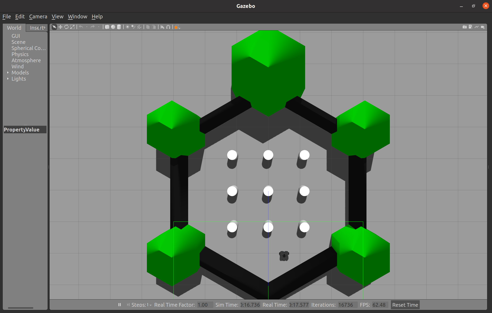
</p>

Вон там снизу справа видишь робота? Это наша вафелька! Если быть точнее, то Turtlebot модели Waffle =)

Попробуй приблизиться с помощью левой, правой клавиш мыши и колёсика (на колёсико ещё можно нажимать) и разглядень поближе:

<p align="center">
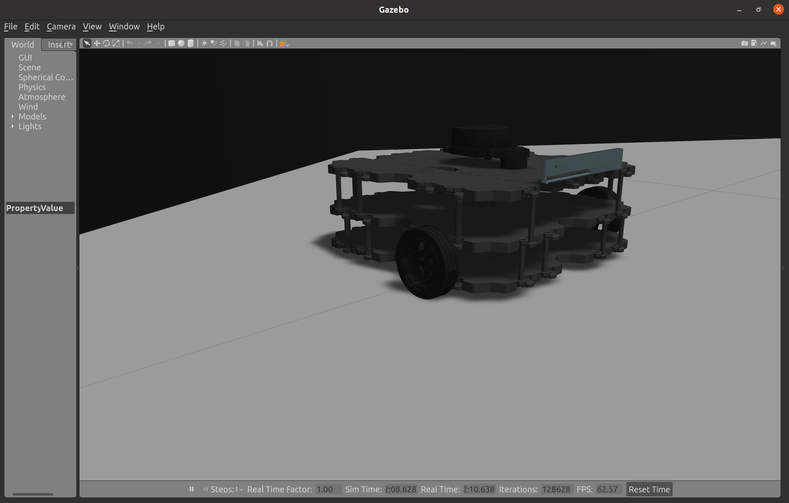
</p>

Какая хорошая детализация, не так ли? Красивый робот =)

Полюбуйся ещё минутку на робота, осмотри карту и двигаем дальше!

## Пора двигаться!

Робот в симуляторе - это безопасная зверюшка, с которой можно делать что угодно, даже если и сломается, то перезапуск всё починет!

Чтобы заставить робота двигаться, надо передать роботу команды управления. Сейчас мы его просто запустили, даже немного осмотрели, но ничего не передаём.

Давай запустим команду, которая включит возможность управления роботом с клавиатуры, как мы делали с 2D черепашкой:

> **Симулятор не выключайте!** Делаем это в отдельном окне!

```bash
# Обратите внимание, тут тоже просят модельку задать
TURTLEBOT3_MODEL=waffle roslaunch turtlebot3_teleop turtlebot3_teleop_key.launch
```

:muscle: Таакс, настроили окна, положили пальцы на WASD (ещё X для хода назад) и погнали!

<p align="center">
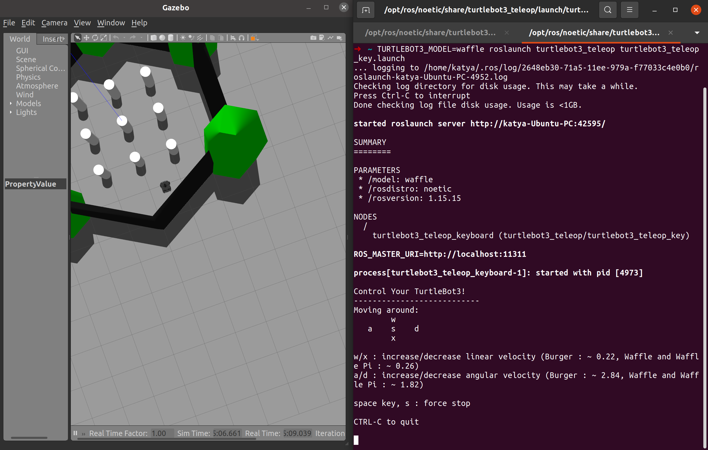
</p>

Отлично! Но подумай, чтобы управлять роботом, нам нужно смотреть сверху, где он находится. Ты в симуляторе смотришь с птичьего вида, а что если нам нужно работать с роботом, которому надо залазить в очень тесные и непролазные места? Нужно научить робота видеть самого!

## Научим робота видеть!

Чтобы дать роботу глаза потребуется две составляющие:

- Датчик, который передаёт информацию об окружающем мире;
- Программа, которая обрабатывает данные с датчика и позволяет воспринимать информацию о дистанции до объектов.

В качестве датчика у нас будет выступать **лидар**! Смотри, где он установлен:

<p align="center">
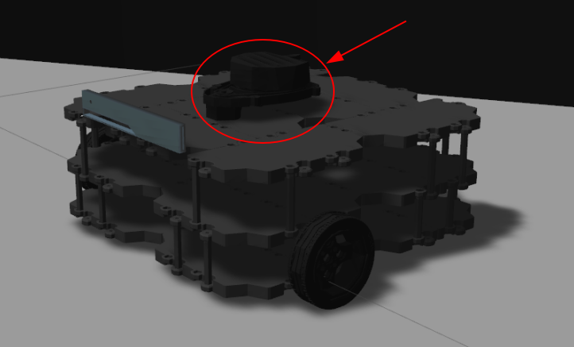
</p>

Подробности о лидаре узнаешь на лекциях, а пока считаем, что это датчик, который сканирует плоскость и получает информацию о расстояниях до препятствий вокруг (360 градусов).

Отлично! Датчик у нас есть, а теперь давай в третьем терминале запустим программу, которая позволит роботу получать информацию с датчиков и обрабатывать её:

```bash
TURTLEBOT3_MODEL=waffle roslaunch turtlebot3_slam turtlebot3_slam.launch
```

<p align="center">
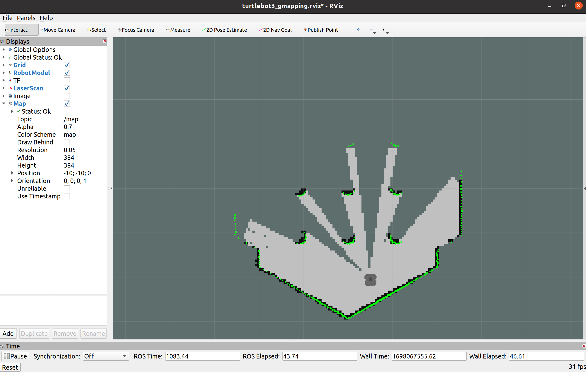
</p>

Если всё запустилось правильно, то запустились программы для получения и обработки данных с лидара. Ты можешь их видеть в интерфейсе программы **rviz**. Rviz - это интерфейс отображения информации в системе робота.

Тут немного разберёмся, в Gazebo виден виртуальный мир симулятора, будто ты смотришь своими глазами, а Rviz - это интерфейс для отображения разной информации, которая есть в роботе! По сути, это взгляд глазами робота. Подумай, своими глазами сверху видишь всю карту, а робот видит только часть, пока никуда не двигался.

Давай посмотрим на информацию пока только с лидара? Отключаем отображение карты, чтобы были видны только робот и данные с лидара:

<p align="center">
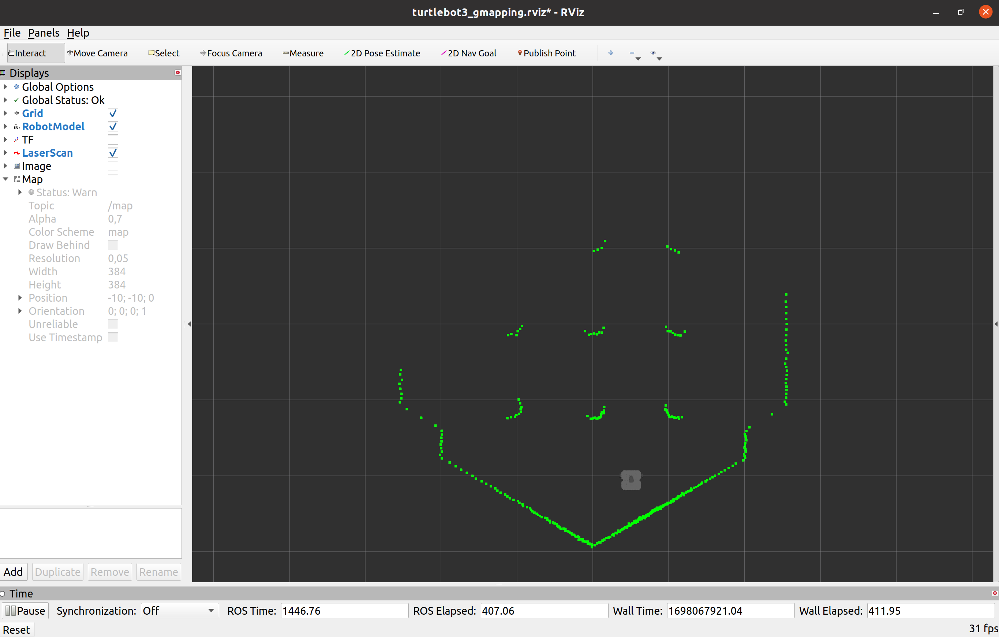
</p>

Отлично, теперь видно только то, что приходит с лидара без обработки!

Давай попробуем немного поменять наш виртуальный мир и убедиться, что информация с лидара меняется! 

Поставь цилиндр на свою карту с помощью кнопки цилиндра и проверь, как поменялись ваши данные с лидара:

<p align="center">
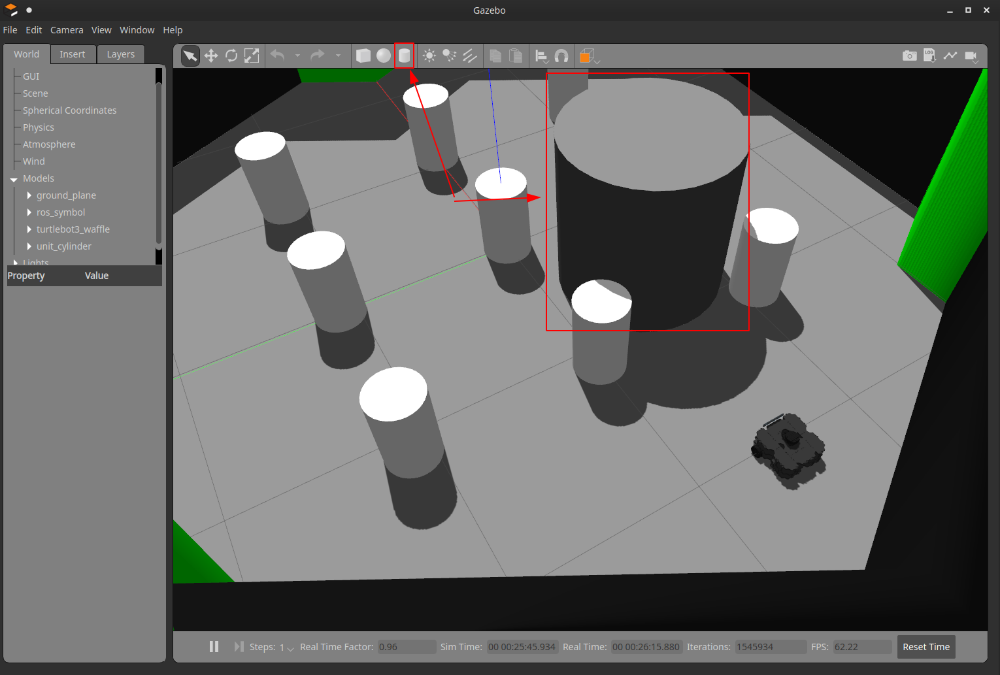
</p>

Поменялись? Понимаешь, как они меняются, если ставите цилиндр в разных местах?

Попробуй попередвигать/поразворачивать/изменять размер цилиндра с помощью этого меню:

<p align="center">
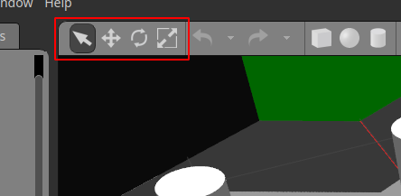
</p>

Убедись, что вы понимаете, как меняются данные с лидара. Если нет - двигай ещё =)

:muscle: Небольшое задание, попробуй поменять размер (диаметр) цилиндра так, чтобы он пропал с лидара. Зависит ли диаметр пропадания от расстояния?

Отлично, после небольшого исследования возвращаем карту на место (включаем в rviz). Если мы активно двигали цилиндр, то на карте можно увидеть такие участки:

<p align="center">
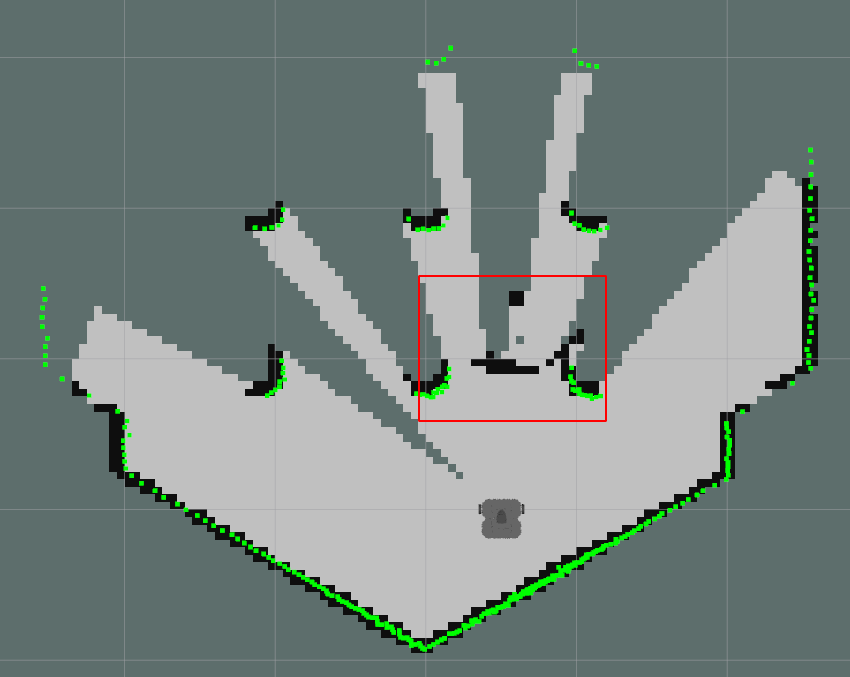
</p>

Это остатки рабочей системы построения карты в нашей среде. Ведь в Rviz мы только отключили отображение карты, но построение карты работало в фоне всё это время! 

Но не беда, сейчас мы будем катать по карте и в ходе покатушек карта обновится и ложные препятствия пропадут.

:muscle: Упс, я уже немного раскрыл следующее задание.. Ну ничего, поехали, переключаем фокус на терминал с управлением с клавиатуры (если закрыли, не беда, просто включите управление teleop) и твоя задача - построить карту нашей небольшой местности. А если чувствуешь в себе дух гонщика, то попробуй сделать это на скорость!

Представляешь, ты всего лишь с помощью пары команд смог запустить робота в симуляторе и уже катаешь его с помощью своей собственной клавиатуры и строишь карту! Круто, правда?

Но согласись, сегодня дистанционным управлением по кнопкам никого не удивить, давай заставим робота двигаться к цели, учитывая информацию с карты?

## Робот, который смог (двигаться к цели)!

Давай выключим управление teleop и запустим программу, которая будет учитывать карту с данными с лидара и строить 

```bash
TURTLEBOT3_MODEL=waffle roslaunch turtlebot3_navigation move_base.launch
```

Вроде запустили move_base вместо teleop, но ничего не поменялось. Правильно, ведь при управлении с клавиатуры тоже ничего не было видно - робот просто стоял и ждал команды, как ему двигаться.

Теперь, робот не ждёт команды с клавиатуры, а ждёт задания цели, куда ему двигаться. Давайте ему зададим эту цель с помощью кнопки `2D Nav Goal`:

<p align="center">
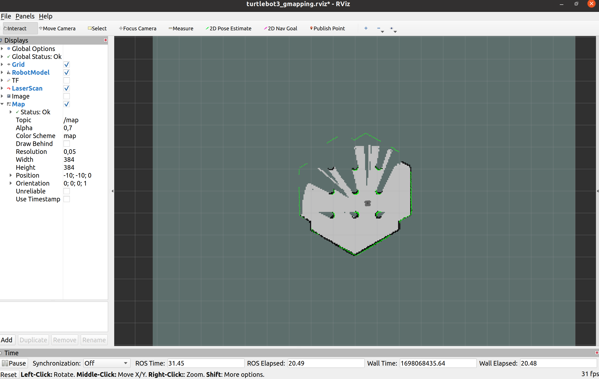
</p>

> Для задания включаете кнопку, левой кнопкой зажимаете в том месте, где хочется остановиться, а затем с зажатой кнопкой управляете направлением постановки.

:muscle: Покатайтесь, посмотрите вид окна gazebo и rviz. Постарайтесь построить полную карту.

Но есть очень важное неудобство, мы не видим маршрута, по которому поедет робот, и цели, куда ему надо ехать. Давайте отобразим эту информацию в rviz!

> Почему именно в rviz? Gazebo - это наш вид из глаз, поэтому мы на нём отобразить информацию не можем. А вот Rviz может отображать информацию, о которой знает робот, поэтому, это самое подходящее место для визуализации!

> Здесь будет без картинки - начинаем привыкать искать подходящие кнопки

В меню Displays (слева в окне) нажимаем `Add`, затем выбираем вкладку `By topic` и ищем путь `/move_base/current_goal`. Выбираем под этим путём строку Pose (с красной стрелкой) и дважды кликаем по ней или снизу нажимаем `OK`.

Отлично, если сейчас задать цель движения, то будет видно, куда он должен двигаться! Круто и очень удобно.

Но ещё, чтобы понимать, как робот поедет, давай отобразим путь робота!

Аналогично переходим в меню выбора отображения (`Add`->`By topic`), выбираем путь `move_base/NavfnROS/plan` и там выбираем Path (зеленая линия). Перед тем, как окончательно выбрать, внизу в Display Name наберите "Global Path".

Отлично, теперь мы видим путь до места, как "планирует" двигаться робот, но зеленый цвет - это очень ярко, поэтому давайте настроим отображение!

В меню Displays найдите Global Path (с зеленой линией), раскройте его, и давайте настраивать:

- Line Style ставим Billboards
- В меню Color выбираем любимый цвет
- В Line Width ставим желаемую толщину линии

Иии, вот так нехитро мы настроили то, как мы хотим видеть информацию внутри робота. Отлично!

Вот так мы научились запускать весь необходимый стек для управления роботом по заданию цели! Поздравляю!

Осталось дело за малым, в следующих темах подробно разобрать, что под этим лежит, чтобы в будущем ты смог сделать своего робота и запустить все необходимое!

## Начинаем создавать что-то свое

До этого момента мы запускали уже готовые программы в разных терминалах, чтобы всё работало. Давай теперь начнём организовывать своё рабочее место, чтобы творить свои интересные штуки!

Например, мы достаточно накатались с черепашкой и хотим сделать своего робота в симуляторе. Робота, который приносит холодные напитки из холодильника! Это же надо не только уметь двигаться к цели, но и управлять манипуляторами (руками робота), а на черепашке такого нету =( Остаётся только творить самим!

Или нам подходит черепашка, но хочется для построения карты использовать другой датчик/другую программу для картографирования.

Или, у нас уже есть робот в реальном мире, но с ним опасно/долго постоянно работать (заряжать приходится, возвращать на начальную точку и т.д.) и мы хотим сделать в симуляторе, чтобы настраивать программы и тестировать работу программ на роботе!

Или...

В практике можно встретить очень много ситуаций, когда нам нужно сделать что-то своё, используя готовые решения (модифицировать их) или совсем с нуля создать. Для этого нам надо познакомиться с понятиями **пакета** и **рабочего пространства (workspace)** в ROS.

## Почему пакеты - это важно?

Представь себе огромный шведский стол! На нём есть разные блюда разной кухни - роллы, пицца, хинкали, борщ и т.д.

Обычно, мы привыкли приходить к столу с подносом, накладывать на тарелки блюда (не смешивая их!) и потом с тарелками на подносе идти за стол. Отлично, на минутку представим вкусный стол, как мы отведаем еду и, если голод напомнил о себе - сходи покушай =)

Так вот давай теперь представим легкую альтернативу:

- Блюдо - это полезные материалы, модели в симуляторе, программы, чего там только нету.
- Тарелка - это **пакет**, мы на него накладываем конкретное блюдо, но не смешиваем с другими, потому что будет невкусно!
- Твой стол - это рабочее пространство, на котором размещаются тарелки и ведётся работа (кушаем-с).

По сути, главная суть аналогии в том, что по пакетам мы раскладываем материалы (коды программ, конфигурации, описания, модели в симуляторе) по разным темам, чтобы не скидывать всё в кучу. Если сложить в кучу, то потом замучаемся разбираться, что и где находится!

То есть, если мы хотим сделать своего робота, то мы может создать отдельный пакет для робота, при этом материалы по другим роботам будут лежать в отдельных пакетах!

Если в нашем роботе есть: телеуправление, навигация, построение карты, то можно сложить это в отдельные пакеты (как, например, у черепашки turtlebot3_teleop, turtlebot3_navigation, turtlebot3_slam).

Рабочее пространство в свою очередь просто объединяет пакеты в себе в системе (на диске).

> Первое время мы будем работать только с двумя рабочими пространствами. С первым уже знакомы - системное, в него устанавливаются все пакеты, которые мы ставим через `sudo apt install ros-noetic-...`. Второе, с которым будем работать - локальное. Там хранятся пакеты, которые мы пишем сами или собираем из исходников.

Надеюсь, важность организации кода и материалов по пакетам понятна? Есть и альтернативный путь - можете создать для всех своих работ единственный пакет и все складывать в него, но потом на своем опыте поймёте, почему такой подход сложен в работе по мере роста проекта =)

## Как мне создать локальный workspace?

> Чуть подготовимся, поставим `catkin` инструмент сборки командой `sudo apt install python3-catkin-tools`

Так, ну если в системном пространстве мы уже запускали пакеты, то где находится локальное?

А его ещё нету =) Его надо создать!

Сделаем это, по общей практике это делается в домашней директории пользователя:

```bash
mkdir $HOME/catkin_ws
```

> Если вы не понимаете, что делает команда `mkdir` или что значит `$HOME` - прочитайте [Shell топик](0_01_Shell.md) в нулевом разделе.

Так мы создадим директорию `catkin_ws` - это и будет нашим локальным (ещё можно назвать пользовательским, так как у каждого пользователя в системе будет своё) пространством.

Но пока это не пространство, а просто папка, давайте сделаем всё, чтобы её инициализировать!

```bash
# Go внутрь
cd ~/catkin_ws
# Стартуем инициализацию
catkin init
```

И должны увидеть что-то наподобии:

```console
Initializing catkin workspace in `/home/user/catkin_ws`.
------------------------------------------------------------------
Profile:                     default
Extending:             [env] /opt/ros/noetic
Workspace:                   /home/user/catkin_ws
------------------------------------------------------------------
Build Space:       [missing] /home/user/catkin_ws/build
Devel Space:       [missing] /home/user/catkin_ws/devel
Install Space:      [unused] /home/user/catkin_ws/install
Log Space:         [missing] /home/user/catkin_ws/logs
Source Space:      [missing] /home/user/catkin_ws/src
DESTDIR:            [unused] None
------------------------------------------------------------------
Devel Space Layout:          linked
Install Space Layout:        None
------------------------------------------------------------------
Additional CMake Args:       None
Additional Make Args:        None
Additional catkin Make Args: None
Internal Make Job Server:    True
Cache Job Environments:      False
------------------------------------------------------------------
Buildlisted Packages:        None
Skiplisted Packages:         None
------------------------------------------------------------------
Workspace configuration appears valid.
------------------------------------------------------------------

------------------------------------------------------------------
WARNING: Source space `/home/user/catkin_ws/src` does
not yet exist.
------------------------------------------------------------------
```

Шикарно! У нас есть рабочее пространство!

Ай-да теперь создавать наш первый пакет в этом пространстве!

## Готовим тарелку

Отлично, пространство мы создали, теперь сделаем свой пакет.

Первое, что нужно сделать - это создать директорию `src` внутри пространства:

```bash
# Обязательно внутри catkin_ws
mkdir src
# Ии заходим внутрь
cd src
```

Теперь создаём пакет с названием `super_robot_package`:

> Если хочешь, можешь создать пакет со своим названием, но дальше тогда придется во всех командах заменять имя.

```bash
catkin create pkg super_robot_package
```

В выводе должен получиться подобный вывод:

```bash
Creating package "super_robot_package" in "/home/user/catkin_ws/src"...
Created file super_robot_package/package.xml
Created file super_robot_package/CMakeLists.txt
Successfully created package files in /home/user/catkin_ws/src/super_robot_package.
```

После создания пакета очень важно его собрать! Для этого используем команду для сборки:

```bash
catkin build super_robot_package
```

В выводе увидите что-то такое:

```bash
NOTE: Forcing CMake to run for each package.
-----------------------------------------------------------
[build] Found 1 packages in 0.0 seconds.
[build] Updating package.
Starting  >>> catkin_tools_prebuild
Finished  <<< catkin_tools_prebuild                [ 2.1 seconds ]
Starting  >>> super_robot_package
Finished  <<< super_robot_package                  [ 1.9 seconds ]
[build] Summary: All 2 packages succeeded!                                                                                                                                                                    
```

Отлично! Как нам теперь проверить, что система ROS видит наш пакет? Познакомимся с утилитой, которая работает с пакетами системы ROS - `rospack`!

```bash
# Посмотрим список пакетов в системе
rospack list
```

В выводе видим:

```bash
...
turtlebot3_gazebo /opt/ros/noetic/share/turtlebot3_gazebo
turtlebot3_msgs /opt/ros/noetic/share/turtlebot3_msgs
turtlebot3_navigation /opt/ros/noetic/share/turtlebot3_navigation
turtlebot3_slam /opt/ros/noetic/share/turtlebot3_slam
turtlebot3_teleop /opt/ros/noetic/share/turtlebot3_teleop
turtlesim /opt/ros/noetic/share/turtlesim
urdf /opt/ros/noetic/share/urdf
urdf_parser_plugin /opt/ros/noetic/share/urdf_parser_plugin
urdf_sim_tutorial /opt/ros/noetic/share/urdf_sim_tutorial
urdf_tutorial /opt/ros/noetic/share/urdf_tutorial
visualization_marker_tutorials /opt/ros/noetic/share/visualization_marker_tutorials
visualization_msgs /opt/ros/noetic/share/visualization_msgs
voxel_grid /opt/ros/noetic/share/voxel_grid
webkit_dependency /opt/ros/noetic/share/webkit_dependency
xacro /opt/ros/noetic/share/xacro
xmlrpcpp /opt/ros/noetic/share/xmlrpcpp
```

Но в этом выводе тяжело искать, давайте отфильтруем этот список, поискав наш пакет:

```bash
rospack list | grep super_robot_package
```

Хм.. Ничего? То есть, наш пакет не видно? Давайте посмотрим, где ROS ищет пакеты с помощью переменной окружения `ROS_PACKAGE_PATH`:

```bash
echo $ROS_PACKAGE_PATH
# /opt/ros/noetic/share
```

Ага, такс, а как заставить ROS искать пакеты в нашем WS (workspace)? Нужно сделать похожее с тем, что мы делали, когда устанавливали ROS.

Для системного пространства мы использовали команду `source /opt/ros/noetic/setup.bash`

Для локального WS мы используем команду:

```bash
source $HOME/catkin_ws/devel/setup.bash
```

После её выполнения проверь наличие пакета!

```bash
rospack list | grep super_robot_package
# super_robot_package /home/user/catkin_ws/src/super_robot_package
```

Оп, вот и пакет нашёлся, значит он теперь учитывается в системе ROS.

:muscle: Убедись с помощью проверки переменной ROS_PACKAGE_PATH, где ищутся теперь пакеты.

> Но ведь команда `source` работает только для нынешней сессии shell, чтобы она вызывалась в каждом терминале, как обычно, прописывай в `~/.bashrc` руками или командой `echo "source \$HOME/catkin_ws/devel/setup.bash" >> ~/.bashrc`.