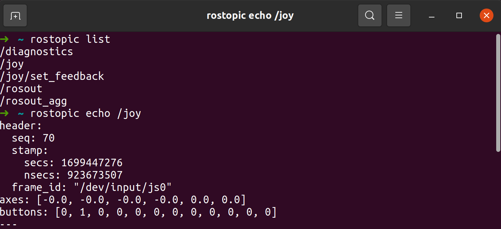

<!-- omit from toc -->
# Начало работы в ROS

- [ROS узлы и топики](#ros-узлы-и-топики)
- [Основные инструменты](#основные-инструменты)
  - [rosnode](#rosnode)
  - [rostopic](#rostopic)
  - [rosmsg](#rosmsg)
  - [Добавим графику](#добавим-графику)
- [Publisher and Subscriber с использованием rospy](#publisher-and-subscriber-с-использованием-rospy)
- [Roslaunch](#roslaunch)
- [Распространенные практики](#распространенные-практики)
  - [Мапирование топиков](#мапирование-топиков)
  - [Подключение других launch-файлов](#подключение-других-launch-файлов)
  - [Создание опций для launch-файлов](#создание-опций-для-launch-файлов)
- [Управление параметрами](#управление-параметрами)
- [YDLidar X2](#ydlidar-x2)
- [Время двигаться!](#время-двигаться)

## ROS узлы и топики

Сегодня мы более детально познакомимся с первыми базовыми вещами ROS - **узлами**. Под узлом подразумевается программа, которая производит некоторые действия. Узлы соединяются **топиками**, через которые передают **сообщения**. Таким образом, приходим к знакомой схемке типа графа.  

Для начала знакомства необходимо запомнить важную вещь! 

>❔ В любой экосистеме ROS существует **мастер** (и он единственный), который работает с узлами. Фактически, он полностью организует их. 

Начнем, чтобы что-то запустить, нужно воспользоваться утилитой запуска узла `rosrun`, которая имеет следующее описание:
`rosrun [pkg_name] [node_name] [additional args]`  
- pkg_name - имя пакета, в котором узел содержится  
- node_name - имя узла в пакете  
- additional args - дополнительные аргументы (рассматривается позже, в нашем случае используется явное задание имени узла в экосистеме ROS (`__name`) )

Let's Go, создаем простейшую систему с топиком и узлами:
- запуск ROS мастера, вся систем зиждется на нем и без него ничего не работает:
```bash
rosсore
```
- узел из пакета `rospy_tutorials` с именем `talker` командой:
```bash
rosrun rospy_tutorials talker
```
- узел из пакета `rospy_tutorials` с именем `listener` командой:
```bash
rosrun rospy_tutorials listener 
```

> 🦾 Запустите узлы утилиты. Не забывайте про то, что если узел при запуске работает бесконечно, то для запуска другого узла нужен новый терминал.

## Основные инструменты

### rosnode

Открываем еще один терминал и начинаем анализ системы вместе с испытанием инструментов.

>🧠 Проверьте возможные команды утилиты `rosnode`

Посмотрим список узлов в системе с помощью:

```bash
rosnode list
```

Также можно посмотреть информацию о конкретном узле, например `/talker`:

```bash
rosnode info /talker
```
Команда нам выдаст следующее :point_down:	

```
--------------------------------------------------------------------------------
Node [/talker]
Publications: 
 * /chatter [std_msgs/String]
 * /rosout [rosgraph_msgs/Log]

Subscriptions: None

Services: 
 * /talker/get_loggers
 * /talker/set_logger_level


contacting node http://user-vb:39115/ ...
Pid: 8733
Connections:
 * topic: /chatter
    * to: /listener
    * direction: outbound
    * transport: TCPROS
 * topic: /rosout
    * to: /rosout
    * direction: outbound
    * transport: TCPROS

```

Сделаем небольшой анализ увиденного:
- Узел зовется `/talker`
- Публикует в два топика: `/chatter` и `/rosout`, второй - топик для логирования, в него автоматически публикуют все узлы, более конкретно рассмотрим потом
- Подписок нет
- Имеет два сервиса, которые тоже создаются автоматически у каждого узла, о сервисах потом
- PID (Porcess ID) = 8733 - это идентификатор процесса в системе Linux, нам он не важен
- Имеет соединения, они должны сходиться с названиями подписок и публикаций, таким образом сообщается, что все публикуется и подписывается корректно (соединения между узлами настроены)

>🧠 Попробуйте проанализировать информацию об узле `/listener`

### rostopic


Давай взглянем на то, как организовано общение между узлами в ROS:

<p align="center">

</p>

Есть ещё такая gif-ка:

<p align="center">

</p>

В ROS каждый узел выполняет свою задачу, но они не могут работать без коммуникации между собой. Так вот топики - это один из способов общения между узлами. Как видно на картинке, узлы могут *публиковать в топики* (Publication - отправлять через него данные) и *подписываться на топики* (Subscription - получать через него данные).

Теперь взглянем на возможности утилиты для анализа топиков

>🧠 Проверьте возможные команды утилиты `rostopic`

Посмотрим на список топиков в системе
```bash
rostopic list
```

Для вывода в более подробной форме воспользуемся опцией -v

```bash
rostopic list -v
```
```
Published topics:
 * /chatter [std_msgs/String] 1 publisher
 * /rosout [rosgraph_msgs/Log] 2 publishers
 * /rosout_agg [rosgraph_msgs/Log] 1 publisher

Subscribed topics:
 * /chatter [std_msgs/String] 1 subscriber
 * /rosout [rosgraph_msgs/Log] 1 subscriber
 ```

В выводе видна информация о подписках и публикациях топиков.

Взглянем на информацию о конкретном топике

```bash
rostopic info /chatter
```
```
Type: std_msgs/String

Publishers: 
 * /talker (http://user-vb:39115/)

Subscribers: 
 * /listener (http://user-vb:42123/)
```

По выводу можно определить, какие узлы подписаны на топик, а какие публикуют в него сообщения.

Далее можно показать сообщения, которые идут через этот топик. Для завершения нажмите Ctrl+C.

```bash
rostopic echo /chatter
```
```
data: "hello world 1536699023.89"
---
data: "hello world 1536699023.99"
---
...
```

>🧠 Найдите в справке утилиты `rostopic` аргумент измерения частоты публикации и измерьте частоту публикации в топик `/chatter`

### rosmsg

Также существует утилита `rosmsg`, которая анализирует типы сообщений

> :brain: Проверьте возможные команды утилиты `rosmsg`

В информации о топике мы видели поле типа сообщений, которые идут через этот топик
```
Type: std_msgs/String
```
В типе можно видеть имя пакета типа `std_msgs` и само название `String`. Чтобы просмотреть, что содержит данный тип сообщения, воспользуемся командой

```bash
rosmsg show std_msgs/String
```
Результат:
```
string data
```
Как видно, данный тип сообщения содержит строковое поле `data`. Таким образом утилита анализирует информацию, связанную со строением (прототипом) сообщения, а не c самими данными в них.

А теперь посмотрим, какие есть сообщения в системе ROS 

```bash
rosmsg list
```
Так как их много, вывод не приводится :tired_face:	

Самый основной пакет сообщений - `std_msgs`, его типы можно глянуть командой, которая показывает типы сообщений, определенные в данном пакете

> :brain: Пройдите все представленные шаги, просмотрите типы сообщений `std_msgs/ColorRGBA`, `geometry_msgs/Pose2D`

### Добавим графику

Запустите графическое представление графа экосистемы с помощью утилиты `rqt_graph`. Вы увидите графический интерфейс, на котором отображены узлы и топик в нашей системе. Также можно управлять настройкой группы `Hide`, что позволяет скрывать некоторые элементы в соответствии с настройкой.

>🦾	Включите `rqt_graph` и в группе `Hide` снимите галочку с `Debug`. Убедитесь в том, что представлены все узлы и топики (даже с отладкой) системы, с помощью утилит `rosnode` и `rostopic`. Как видно, узел `/rosout` и топик `/rosout` создаются для отладки и соединяются со всеми узлами через топик `/rosout`.

>🦾	Запустите узел пакета `rospy_tutorials` с именем `listener`, но присвойте имя `__name:=listener2`. Проверьте с помощью `rqt_graph`, что оба `listener` подключилиь на общий топик.

>🦾 Запустите узел пакета `rospy_tutorials` с именем `talker` и присвойте такое же имя `__name:=talker`. Убедитесь, что первый `talker` закрылся с сообщением о перехвате (`shutdown request: new node registered with same name`).

## Publisher and Subscriber с использованием rospy

Самое время познакомиться с возможностями написания узлов на языке Python. Для этого давайте в нашем пакете создадим папку ```start``` и в ней сделаем папку ```scripts```

Сначала взглянем на код, который будем разбирать:

```python
#!/usr/bin/env python

import rospy
from std_msgs.msg import String

def publisher():
    pub = rospy.Publisher('my_topic', String, queue_size=10) # создаем publisher для топика my_topic
    rospy.init_node('my_publisher', anonymous=True) # инициализируем node ros
    rate = rospy.Rate(10) # создаем таймер, который будет выполнять цикл 10 раз в секунду

    while not rospy.is_shutdown(): # проверяем, не был ли node остановлена
        str = "hello world %s" % rospy.get_time() # формируем строку для публикации
        rospy.loginfo(str) # записываем строку в лог ros
        pub.publish(str) # публикуем строку в топик my_topic
        rate.sleep() # ждем следующей итерации

if __name__ == '__main__':
    try:
        publisher() # запускаем функцию публикации
    except rospy.ROSInterruptException:
        pass # обрабатываем исключение, возникающее при остановке ноды ros
```

В этом коде мы создаем ноду ros, которая будет публиковать строки в топик ```my_topic```. Используя функцию rospy.Publisher, мы создаем объект publisher.

Затем создаем таймер с частотой 10 Hz с помощью функции rospy.Rate.

В цикле, который работает пока нода ros не будет остановлена, формируем строку для публикации, пишем ее в лог ros и публикуем в топик ```my_topic```.


> Задачка по самостоятельной интеграции скрипта в наш пакет:
- :mechanical_arm:	Внутри пакета создать папку `scripts` (Python файлы считаются скриптами), в ней создать файл talker.py и в нем разместить код узла.
- :mechanical_arm:	Далее дать права на выполение с помощью команды `chmod +x talker.py`. Необходимо, чтобы вы находились в одной папке со скриптом.
- :mechanical_arm:	Попробовать запустить в системе ROS созданный узел, для ранее созданного пакета команда будет следующей:  
`rosrun study_pkg talker.py`
- :brain:	Поскольку мы не задавали флаг анонимности в функции `rospy.init_node('talker')` (по-умолчанию там стоит `anonymous=False`), явно присваивать имя узла не требуется, оно будет такое, как было задано в функции `rospy.init_node()`
- :brain:	При возникновении каких-либо ошибок, они будут выведены в терминале 

А теперь перейдем к написанию узла подписки. 

```python
#!/usr/bin/env python

import rospy
from std_msgs.msg import String

def callback(data): # Обработчик приема сообщений из топика
    rospy.loginfo("Received message: %s", data.data) # Обработчик вызывается каждый раз, как узел получает сообщение

def subscriber():
    rospy.init_node('my_subscriber', anonymous=True) # регистрируем узел
    rospy.Subscriber("my_topic", String, callback)  # подписываемся на топик с указанием обработчика
    rospy.spin() # удержание программы в рабочем состоянии

if __name__ == '__main__':
    try:
        subscriber()
    except rospy.ROSInterruptException:
        pass
```

После остается лишь оставить узел работать до завершения системы ROS или прерывания узла (Ctrl+C). В момент регистрации подписки на топик узел уже готов принимать сообщения (прием происходит в отдельном потоке).  
С одной стороны можно использовать `rospy.is_shutdown()`. Такая практика рапространена, если необходимо еще что-то делать в узле помимо приема сообщений.  
Для простого приема сообщений можно вызвать `rospy.spin()`, который будет удерживать программу рабочей до тех пор, пока ROS не завершится или узел не бует прерван. 

> :mechanical_arm: Создайте также и скрипт `listener.py` в пакете. Запустите оба узла и убедитесь в работоспособности (один отправляет, другой получает сообщения).

## Roslaunch

Только что мы столкнулись с тем, что каждый узел нужно запускать в разных терминалах. Но мы с вами запускали по 2-3 узла, а что будет, если нужно одновременно запустить больше таких? Ведь в реальных системах может присутствовать 10, 20 и более узлов, что может вызвать огромную боль при включении/выключении/проверке всех узлов. Звучит как-то не очень. 

Для облегчения жизни придумали специальный формат, основанный на формате `xml`. Суть данного формата в том, что он позволяет настраивать и запускать группы узлов. Это еще можно назвать скриптом запуска.

Для начала, попробуем рассмотреть простой launch-файл (так они называются, угадайте, как должна называться папка, в которой они хранятся (```launch``` внутри нашей папки ```start```)). Смотрим 👇	

```xml
<launch>
    <node name="listener" pkg="rospy_tutorials" type="listener.py" output="screen"/>
    <node name="talker" pkg="rospy_tutorials" type="talker.py" output="screen"/>
</launch>
```

>❔ Раньше мы запускали узел `talker`, указывая `rosrun rospy_tutorials talker`. Когда мы пишем на Python, мы создаем скрипты `.py`. Так что оригинально при работе с Python запускаемые файлы будут с расширением `.py`. А в пакете `rospy_tutorials` разработчики просто скопировали файл `talker.py` в `talker`. Можете убедиться сами, у них размер одинаковый.
Основа launch-файла лежит в тэге `<launch>`, он оборачивает весь файл.

Далее вложенные тэги `<node>` задают запуск узлов. В качестве параметров тэгов указываются:

- `name` - имя, которое присваивается узлу в системе ROS (аналог `__name`)
- `pkg` - название пакета, внутри которого лежит узел
- `type` - название файла узла внутри пакета (для Pyhton - py-файлы, для C++ - исполняемые файл, там уж как назовете при компиляции)
- `output` - (необязательный) режим вывода информации, есть варианты `screen` (в консоль) и `log` (по-умолчанию, в лог-файл)

>❔ При запуске launch-файла также запускается мастер (roscore), если он не был запущен ранее.
Таким файлом из примера удобно пользоваться, так как вместо трех консолей потребуется единственная, в которую будет выкладываться вывод всех узлов, у которых `output="screen"`.

Кстати, такой файл уже есть в пакете `rospy_tutorials`, прочитать его можно командой:

```bash
roscat rospy_tutorials talker_listener.launch
```

Утилита для запуска называется `roslaunch` и вот пример запуска такого файла из пакета `rospy_tutorials`:

```bash
roslaunch rospy_tutorials talker_listener.launch
```

Выключение всех узлов из файла производится нажатием Ctrl+C в терминале, в котором запускали launch-файл. При этом система launch проверяет, что все узлы завершились.

>🦾	Напишите launch-файл `my_first.launch` с таким же содержанием и запустите его. Для этого нужно в пакете создать папку `launch` и в ней создать файл с расширением launch. Сделайте небольшую поправочку - измените имена узлов на `sender` и `receiver`. С помощью утилиты `roslaunch`  запустите файл из своего пакета `kitty_package` и убедитесь, что все работает.

## Распространенные практики

### Мапирование топиков

Часто неоходимо переименовать (мапировать) топики узлов. Делается это тэгами `<remap>` внутри тэга `<node>` и параметрами `from` и `to`:

```xml
<launch>
    <node name="listener" pkg="rospy_tutorials" type="listener.py" output="screen">
        <remap from="chatter" to="my_topic"/>
    </node>
    <node name="talker" pkg="rospy_tutorials" type="talker.py" output="screen">
        <remap from="chatter" to="my_topic"/>
    </node>
</launch>
```

>🦾	Смапируйте запускаемые узлы в файле `my_first.launch` к топику `new_topic`

### Подключение других launch-файлов

Иногда можно написать много простых launch-файлов и запустить все их с помощью одного launch-файла. Для этого существует тэг `<include>`:

```xml
<launch>
    <include file="$(find kitty_package)/launch/otherfile.launch" />
    <node name="listener" pkg="rospy_tutorials" type="listener.py" output="screen"/>
    <node name="talker" pkg="rospy_tutorials" type="talker.py" output="screen"/>
</launch>
```

Директива `(find kitty_package)` ищет пакет, имя которого передано аргументом (в нашем случае ищется путь до пакета `kitty_package`) и подставляет путь до него в случае удачного нахождения. Таким образом выполняется сначала launch-файл `otherfile.launch`, а затем остальное содержимое. Уровни вложенности launch-файлов не ограничены (насколько я знаю).

>🦾	Напишите launch-файл `another_one.launch` и добавьте его запуск в `my_first.launch` под пространством имен `new_ns`. Launch-файл `another_one.launch` должен запускать узел `listener` из пакета `roscpp_tutorials`, иметь имя `listener_cpp` и смапировать топик `chatter` к `new_topic`.

### Создание опций для launch-файлов

Иногда создание опреленной системы упрощается, если при запуске существует возможность передать опции файлу запуска. Для launch-файлов существует тэг `<arg>`, который добавляет аргументы launch-файлу:

```xml
<launch>
    <arg name="new_topic_name" default="new_chatter" />

    <node name="listener" pkg="rospy_tutorials" type="listener.py" output="screen">
        <remap from="chatter" to="$(arg new_topic_name)"/>
    </node>
    <node name="talker" pkg="rospy_tutorials" type="talker.py" output="screen">
        <remap from="chatter" to="$(arg new_topic_name)"/>
    </node>
</launch>
```

❔ Директива `(arg new_topic_name)` подставляет значение аргумента. При наличии параметра `default` в тэге `<arg>` установка параметра при запуске launch-файла не обязательна. Для задания значения аргумента выполнение roslaunch происходит следующим образом:

```bash
roslaunch rospy_tutorials talker_listener.launch new_topic_name:=my_topic
```
## Управление параметрами

Сейчас хочется обратить внимание на приватные параметры с точки зрения практики. Обычно узлы стартуют с помощью launch-файлов, поэтому задаются параметры внутри с помощью тэгов `<param>`. Пример из одного из файлов планера:

```xml
    <param name="base_global_planner" value="global_planner/GlobalPlanner" />
    <param name="planner_frequency" value="1.0" />
    <param name="planner_patience" value="5.0" />
```
Таким образом задаются локальные параметры (с учетом ns).

Еще немного для понимания, пример из драйвера камеры (внутри тэга `<node>` параметры задаются приватными!):

```xml
<node ns="stereo" name="left_camera" pkg="usb_cam" type="usb_cam_node" output="screen" >
    <param name="video_device" value="/dev/video0" />
	<param name="image_width" value="640" />
	<param name="image_height" value="480" />
</node>
```

Здесь с помощью параметров задается путь девайса (конкретный, так как таких может быть много) и размеры выходного изображения.

## YDLidar X2

В наших с вами задачах мы будем использовать небольшой лидар, представленный на картинке ниже:

<p align="center">

</p>


Lidar YDLidar X2 - это лидар с 2D-сканированием, основанный на принципе тени.

Основные характеристики Lidar YDLidar X2:

- Максимальное угловое разрешение: 1200 (одинарный зрачок), - 600 (двойной зрачок) градусов
- Максимальное угловое поле зрения: 270 градусов
- Максимальное расстояние обнаружения: 20 метров
- Скорость обмена данными: 8000-10000 бит/с
- Диапазон рабочих температур: -10

Для работы с датчиком Lidar YDLidar X2 необходимо установить пакеты:

- ```YDLidar-SDK library```
- ```ydlidar_ros_driver```

Вообще, вся установка - код, который вы можете запустить из любого места у вас описана уже в ```00_installation.md```, воспользовавшись командой вы и все и установите:

 ```bash
 sudo sh [CODE_NAME]
 ```

Поехали дальше. На [страничке Github нашего лидара](https://github.com/YDLIDAR/ydlidar_ros_driver) мы можем найти информацию о том, что лидар публикует, какой тестовый launch файл мы можем запустить, ну и он сам - давайте на него взглянем:

```xml
<launch>
  <node name="ydlidar_lidar_publisher"  pkg="ydlidar_ros_driver"  type="ydlidar_ros_driver_node" output="screen" respawn="false" >
    <!-- string property -->
    <param name="port"         type="string" value="/dev/ydlidar"/>  
    <param name="frame_id"     type="string" value="laser_frame"/>
    <param name="ignore_array"     type="string" value=""/>

    <!-- int property -->
    <param name="baudrate"         type="int" value="115200"/>  
    <!-- 0:TYPE_TOF, 1:TYPE_TRIANGLE, 2:TYPE_TOF_NET -->
    <param name="lidar_type"       type="int" value="1"/>  
    <!-- 0:YDLIDAR_TYPE_SERIAL, 1:YDLIDAR_TYPE_TCP -->
    <param name="device_type"         type="int" value="0"/>  
    <param name="sample_rate"         type="int" value="3"/>  
    <param name="abnormal_check_count"         type="int" value="4"/>  

    <!-- bool property -->
    <param name="resolution_fixed"    type="bool"   value="true"/>
    <param name="auto_reconnect"    type="bool"   value="true"/>
    <param name="reversion"    type="bool"   value="false"/>
    <param name="inverted"    type="bool"   value="true"/>
    <param name="isSingleChannel"    type="bool"   value="true"/>
    <param name="intensity"    type="bool"   value="false"/>
    <param name="support_motor_dtr"    type="bool"   value="false"/>
    <param name="invalid_range_is_inf"    type="bool"   value="false"/>
    <param name="point_cloud_preservative"    type="bool"   value="false"/>

    <!-- float property -->
    <param name="angle_min"    type="double" value="-180" />
    <param name="angle_max"    type="double" value="180" />
    <param name="range_min"    type="double" value="0.1" />
    <param name="range_max"    type="double" value="12.0" />
    <!-- frequency is invalid, External PWM control speed -->
    <param name="frequency"    type="double" value="10.0"/>
  </node>
  <node pkg="tf" type="static_transform_publisher" name="base_link_to_laser4"
    args="0.0 0.0 0.2 0.0 0.0 0.0 /base_footprint /laser_frame 40" />
</launch>
```

Давайте внутри нашего пакета создадим папку  ```kitty_vision```, а в ней папку ```launch```, а там ```drivers``` и скопируем туда этот launch, например, под названием ```start_ydlidar_x2.launch```.  

Помните, когда мы с вами проходили первый урок, мы уже познакомились с ```rviz```? Давайте теперь его запустим в другом терминале командой 

```
rviz
```

У нас открылось окно, но никакой информации из него мы пока получить не можем.

<p align="center">

</p>

Следовательно, его нужно настроить, а для этого `Add->By topic->/scan->LaserScan` и `Fixed Frame` меняем на `base_footprint`:

<p align="center">

</p>

Отлично! Теперь мы видим, что данные с лидара к нам приходят. Можно еще поменять отображение точек, например изменить их стиль `Style` или размер `Size (m)`. Настройте, как вам будет удобнее и поехали дальше. 

<p align="center">

</p>

На самом деле, расскажем вам по секрету не всегда обязательно открывать второй терминал для запуска ```rviz```, а для этого можно воспользоваться строчкой:

```
<node name="rviz" pkg="rviz" type="rviz" args="-d /path/to/your/rvizconfigfile"/>
```

Обратите внимание, что ```"path/to/your/rvizconfigfile" ``` это путь к конфигу rviz, который вы должны создать. Если у вас пока нет такого файла, то уберите ```args```, как аргумент. Но давайте все равно разберемся, как нам сохранить конфигурационный файл. 


После того, как вы все настроили, сохраняем наш конфиг в папку ```rviz``` внутри ```kitty_vision```. Для этого нужно ее заранее создать и выполнить `Ctrl+Shift+s`. Названия желательно делать понятные каждому, поэтому предлагаем оставить такое: `start_ydlidar.rviz`

Отлично! С этим мы справились.

>🦾	Теперь предлагаем создать ```launch``` файл, который будет запускать у нас и драйвер для лидара и ```rviz```. Попробуйте это сделать самостоятельно, а потом загляните в решение. Ваше решение поместите в папку ```kitty_vision->launch->full->full_start_lidar.launch```

<details>
<summary>
👾👾👾 Внимание ответ!
</summary>

```xml
<launch>
 <!-- Start ydlidar -->
 <include file="$(find kitty_package)kitty_vision/launch/drivers/start_ydlidar_x2.launch" />

 <!-- Start rviz -->
 <node name="rviz" pkg="rviz" type="rviz" args="-d /path/to/your/rvizconfigfile"/>
</launch>
```

</details>


>🦾 Для закрепления создайте опцию для вашего ```full_start_lidar.launch```, в котором ```rviz``` будет запускаться только в том случае, если `<arg>` принимает значение `True`. В таком случае ваш `launch` с лидаром будет запускаться, как:

```bash
roslaunch kitty_package full_start_lidar.launch rviz:=True
```

или

```bash
roslaunch kitty_package full_start_lidar.launch rviz:=False
```
<p align="center">

</p>

<p align="center">

</p>

Параметр  `support_motor_dtr` используется в драйвере YDLIDAR для определения того, поддерживает ли устройство управление направлением вращения двигателя через вывод DTR (Data Terminal Ready). По умолчанию, в `launch` лидара, который мы с вами запускаем, этот параметр принимает значение `False` , давайте откроем терминал и передадим ему значение `True`

```bash
rostopic pub -1 /support_motor_dtr std_msgs/Bool "data: true"
```

Давайте проверим, что комманды таким образом доходят, для этого создадим ```kitty_vision->scripts->check_rostopic.py```

```python
#!/usr/bin/env python
import rospy
from std_msgs.msg import Bool

def callback(data):
    rospy.loginfo("Received %s", data.data)

rospy.init_node('check_rostopic')
rospy.Subscriber("/support_motor_dtr", Bool, callback)
rospy.spin()
```

Далее в одном терминале выполните команду, а в другом запустите ваш скрипт. Тогда в первом терминале должно будет появится сообщение:

``` bash
INFO: Received True
```

<p align="center">

</p>

>🦾 Напишите программу, в котором функция `send_stop_command()` создает Publisher на топик /`support_motor_dtr`. Затем она создает сообщение типа `Bool` с полем `data`, установленным в `False`. И наконец, публикует сообщение. Объект `rospy.Rate` обеспечивает отправку сообщения со скоростью 10 Гц.

<details>
<summary>
👾👾👾 Внимание ответ!
</summary>

```python
#!/usr/bin/env python

import rospy
from std_msgs.msg import Bool

def send_stop_command():
    # Publisher setup
    pub = rospy.Publisher('/support_motor_dtr', Bool, queue_size=10)
    rospy.init_node('support_motor_dtr_stopper', anonymous=True)
    rate = rospy.Rate(10) # 10hz
    msg = Bool()
    msg.data = False
    rospy.loginfo("Sending stop command...")
    pub.publish(msg)
    rate.sleep()

if __name__ == '__main__':
    try:
        send_stop_command()
    except rospy.ROSInterruptException:
        pass
```
</details>

## Время двигаться!

```bash
TURTLEBOT3_MODEL=waffle roslaunch turtlebot3_gazebo turtlebot3_world.launch
```

```bash
TURTLEBOT3_MODEL=waffle roslaunch turtlebot3_teleop turtlebot3_teleop_key.launch
```

<p align="center">

</p>

<p align="center">

</p>

Беспроводный геймпад Logitech F710 – это универсальный и популярный геймпад, предназначенный для использования как с ПК, так и с устройствами на платформе Android. Он предлагает беспроводное подключение и ряд функций.

<p align="center">

</p>

**Таблица индексных номеров /joy.buttons**

| Индекс | Название кнопки на фактическом контроллере |
| ------ | ------------------------------------------- |
| 0      | X                                           |
| 1      | A                                           |
| 2      | B                                           |
| 3      | Y                                           |
| 4      | LB                                          |
| 5      | RB                                          |
| 6      | LT                                          |
| 7      | RT                                          |
| 8      | Back                                       |
| 9      | Start                                      |
| 10     | Кнопка стика слева                        |
| 11     | Кнопка стика справа                       |

**Таблица индексов осей /joy.axes:**

| Индекс | Название оси на фактическом контроллере |
| ------ | ----------------------------------------- |
| 0      | Ось влево/вправо стика слева             |
| 1      | Ось вверх/вниз стика слева               |
| 2      | Ось влево/вправо стика справа            |
| 3      | Ось вверх/вниз стика справа              |
| 4      | Крестовина влево/вправо                  |
| 5      | Крестовина вверх/вниз                   |

Перейдем к запуску нашего джойстика. Давайте создадим launch файл, к примеру, ```my_joy_launch.launch```

```xml
<launch>
    <node name="joy_node" pkg="joy" type="joy_node" output="screen">
        <param name="dev" value="/dev/input/js0" />
    </node>
</launch>
```
Запустим его:

```bash
roslaunch kitty_package my_joy_launch.launch
```

<p align="center">

</p>

```bash
TURTLEBOT3_MODEL=waffle roslaunch turtlebot3_gazebo turtlebot3_world.launch
```
```xml
<launch>
  <arg name="joy_config" default="ps3" />
  <arg name="joy_dev" default="/dev/input/js0" />
  <arg name="config_filepath" default="$(find teleop_twist_joy)/config/$(arg joy_config).config.yaml" />
  
  <node pkg="joy" type="joy_node" name="joy_node">
    <param name="dev" value="$(arg joy_dev)" />
    <param name="deadzone" value="0.3" />
    <param name="autorepeat_rate" value="20" />
  </node>

  <node pkg="teleop_twist_joy" name="teleop_twist_joy" type="teleop_node">
    <rosparam command="load" file="$(arg config_filepath)" />
  </node>
</launch>
```

```yaml
axis_linear: 1  # Left thumb stick vertical
scale_linear: 0.7
scale_linear_turbo: 1.5

axis_angular: 0  # Left thumb stick horizontal
scale_angular: 0.4

enable_button: 2  # Left trigger button
enable_turbo_button: 5  # Right trigger button
```

```bash
roslaunch teleop_twist_joy teleop.launch joy_config:=xbox
```
Для движения нашего робота нужно держать кнопку `X` или если мы хотим прокатиться в турбо режиме - `RB`

<p align="center">

</p>