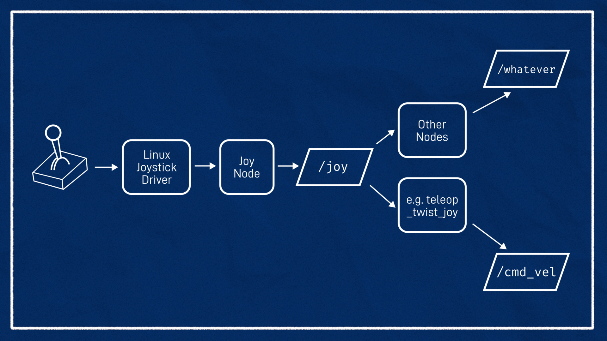

<!-- omit from toc --> 
# Управление с джойстика

- [Подготовка](#подготовка)

## Подготовка

Мы с вами уже создавали launch для нашего робота в симуляторе, теперь время двигаться дальше и нужно создать уже для нашего реального робота.

Тут все достаточно просто, нам нужно обеспечить связь между контроллером и компьютером и корректно обрабатывть нажатия на джойстике. 
Основное управление у нас будет на левом и правом стике. Скрипт помощники `joy_ctrl.py` уже лежит в папке `source` этого репозитория.

<p align="center">

</p>

<p align="center">

</p>

> Нашли? едем дальше, нам теперь нужно создать файл, который будет объединять `joy_ctrl.py` и `joy_node` обзовем его, как `start_joy_teleop.launch` и поместим его в `kitty_software->drivers`


```xml
<?xml version="1.0"?>
<launch>

    <arg name="cmd_topic" default="cmd_vel" />
    <arg name="speed/frwd_limit" default="1.0"/>
    <arg name="speed/bkwrd_limit" default="-0.6"/>
    <arg name="steer/limit" default="35"/>

    <!-- http://wiki.ros.org/joy -->
    <node pkg="joy" type="joy_node" name="joy_node" output="screen" >
        <param name="dev" value="/dev/input/js0" />
        <param name="deadzone" value="0.3"/>
        <remap from="diagnostics" to="joy_node/diagnostics"/>
    </node>

    <node pkg="kitty_package" type="joy_ctrl.py" name="joy_ctrl" output="screen" >
        <param name="debug" value="false" />
        <param name="speed/frwd_limit" value="$(arg speed/frwd_limit)" />
        <param name="speed/bkwrd_limit" value="$(arg speed/bkwrd_limit)" />
        <param name="steer/limit" value="$(arg steer/limit)" />
        <remap from="cmd_vel" to="$(arg cmd_topic)" />
    </node>

</launch>
```

Осталось в принципе немного, мы уже сказали, что нужно также обеспечить корректную связь между компьюетром (ROS) и микроконтроллером, кстати, кто еще не понял, как он выглядит: 

<p align="center">

</p>

Для обспечения связи и корректной передачи данных у нас будет два файла

1. `uc_serial_server.launch` , который будет обеспечиват передачу данных по `UART`. 

> ❔ UART - возможно, самый известный и широко применяемый интерфейс передачи данных. С его помощью к Ардуино подключаются датчики, исполнительные устройства, индикаторы и дисплеи, GPS и GPRS-модули. Через него осуществляется заливка программы в Ардуино и ее отладка.

```xml
<?xml version="1.0" encoding="UTF-8"?>
<launch>
    <arg name="port" default="/dev/ttyUSB0" />
    <node pkg="rosserial_python" type="serial_node.py" name="serial_node" output="screen">
        <param name="port" value="$(arg port)" />
        <param name="baud" value="57600" />
    </node>
</launch>
```

Сохраните его в `kitty_software -> drivers`

2. `uc_convertion_layer.launch` -лаунч, который обеспечивает корректную передачу данных с `ROS` на наш микроконтроллер

```xml
<?xml version="1.0" encoding="UTF-8"?>
<launch>
    <node pkg="kitty_package" type="cmd_publisher.py" name="cmd_publisher" output="screen"/>
</launch>
```
Сохраните его в `kitty_software -> drivers`

Тут еще подгружается топик, который выглядите следующим образом: 


```python
#!/usr/bin/env python3
from logging import shutdown
import rospy
from kitty_msgs.msg import KittyState
from geometry_msgs.msg import Twist
from math import pi

def callback(msg):
    # m/s to rev/min
    my_msg.rotation_speed = msg.linear.x * rev_convertation
    my_msg.angle_steering = msg.angular.z * deg_convertation
    my_msg.front_right_steering_angle = 0
    rospy.loginfo("Linear is %.2f \n angular is %.2f", my_msg.rotation_speed, my_msg.angle_steering)

# rospy.spin()


rospy.init_node('cmd_publisher')
pub = rospy.Publisher('set_speed', KittyState, queue_size=10)
rospy.Subscriber('/kitty/cmd_vel', Twist, callback, queue_size=10)

rate = rospy.Rate(5)
my_msg = KittyState()
wheel_d = 0.065 
rev_convertation = 60 / (pi*wheel_d)
deg_convertation = -180/pi

while not rospy.is_shutdown():  
    pub.publish(my_msg)
    rate.sleep()
```

Сохраните его в `kitty_software -> scripts`

> Теперь нам нужно создать файл полного запуска управления с джойстика, обзовем его, как: `full_start_joy_control.launch`. Он должен будет включать в себя:
- `start_joy_teleop.launch`. В нем нужно будет задать аргументы `frwd_limit`, `bkwrd_limit`, `steer_limit`, у которого будут значения `2`, `-1`, `30` соответственно.
- `uc_serial_server.launch`. Не забудьте в него добавить аргумент `port`, принимающий значение `/dev/ttyACM0`
- `uc_convertion_layer.launch`

